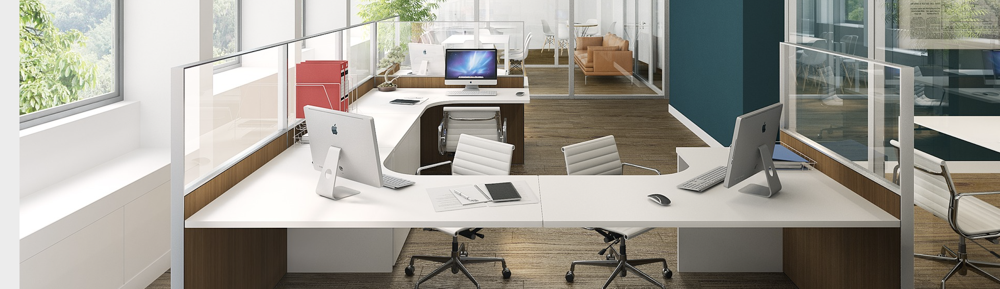

  

# Corporate Employee

A scenario-based RPG web application

## Do you have what it takes to get through the work day as a corporate employee?

Navigate your way through a series of corporate cliches for each hour of the 9am-5pm work day. Don't worry, you'll have a nice analog clock helping you keep track of the time of day as your progress in the game.

## Tech stack

- HTML, Javascript
- Materialize CSS

## Wireframes

coming soon.

## MPV Goals

- one mode: acting as the corporate employee.
- scenario for each hour of the work day (9am = scenario 1, 10am = scenario 2, etc.). 
- analog clock on screen that moves according to what number scenario has been reached
- minimum of two decisions for each scenario.
- each decision is assigned a number of points
- your total number of points determines your ability to navigate the work day, which is sorted into three bins: 
    1) You are a star employee! You could ask for a raise, but don't hold your breath. 
    2) You get the job done... I guess. 
    3) Maybe you should revaluate your place in this corporate office.

## Stretch Goals

- two modes: 
   1) acting as the boss of the corporate employee.
   2) acting as the corporate employee. 
- Scenarios for the two modes are completely different. 
- random scenario is thrown in that results in game over.

## Potential roadblocks

- There is a strong potential for errors or disorganization if strong pseudocode planning does NOT occur.
