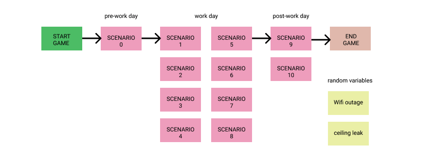

  

# Corporate Employee

*A scenario-based RPG web application*

## Do you have what it takes to get through the work day as a corporate employee?

Navigate your way through a series of corporate cliches for each hour of the 9am-5pm work day. Don't worry, you'll have a nice analog clock helping you keep track of the time as the day progresses within the game.

### Tech stack

- HTML, Javascript
- Materialize CSS/JS

### Wireframes

Initial wireframes to show flow of game.

### MPV Goals

- one mode: acting as the corporate employee.
- scenario for each hour of the work day (9am = scenario 1, 10am = scenario 2, etc.). 
- analog clock on screen that moves according to what number scenario has been reached
- minimum of two decisions for each scenario.
- each decision is assigned a number of points
- your total number of points determines your ability to navigate the work day, which is sorted into one of three bins (or performance reviews, if you will): 
    - 1: You are a star employee! You could ask for a raise, but don't hold your breath. 
    - 2: You get the job done... I guess. 
    - 3: Maybe you should revaluate your place in this corporate office.

### Stretch Goals

- utilizing random number generators:
    - Wifi outage: random scenario is thrown in that results in game over.
    - Ceiling leak: random scenario is thrown in that results in rain drop noise for the rest of the game.
- upon completion of work day, offer two options:
    - 1: Try again (resets game)
    - 2: Resign (prompts a resignation scenario)

*I used to be interested in having two "player modes", one as boss and one as employee, but I realized that I wanted the focus of the game to be exclusively from the perspective of the employee*

### Potential roadblocks

- There was a strong potential for errors or disorganization if strong pseudocode planning did not occur ahead of time. As a result, I spent large amounts of time with psuedocode and sticky notes. Lots and lots of sticky notes. 
